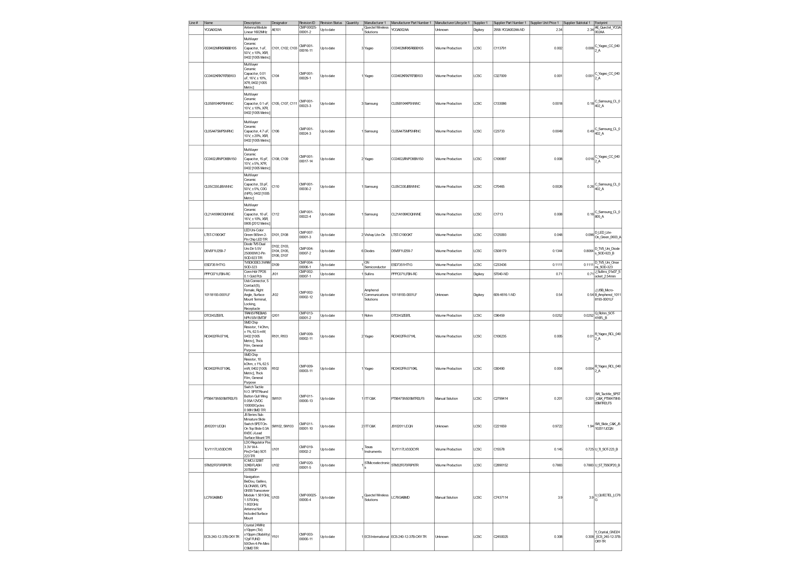

# EVB-A32QS1-RFRG

A GNSS receiver development board based on a STM32 MCU. In the `Export` folder you can find an overview of the schematic, PCB and bill of materials.

## schematic

## PCB

## BOM

